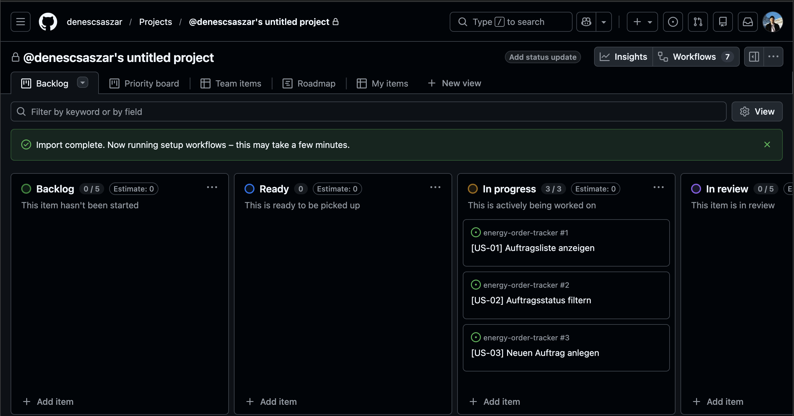

# ⚡ Energy Order Tracker

> B2B Auftragsmanagement für Energiedienstleister — vom Erstkontakt bis zum Vertragsabschluss, ohne Medienbrüche.


---

## Inhaltsverzeichnis

- [Vision](#vision)
- [Problem & Lösung](#problem--lösung)
- [Tech Stack](#tech-stack)
- [Getting Started](#getting-started)
- [API Endpoints](#api-endpoints)
- [PO Artefakte](#po-artefakte)
- [Screenshots](#screenshots)

---

## Vision

Transparente, digitale Auftragsverarbeitung für Energiedienstleister —
von der Kundenanfrage bis zum Vertragsabschluss in einem zentralen System.

---

## Problem & Lösung

| ❌ IST (heute) | ✅ SOLL (Energy Order Tracker) |
|---|---|
| Aufträge in E-Mail + Excel | Zentrales Dashboard |
| Kein sichtbarer Status | Statusverfolgung in Echtzeit |
| Manuelle Datenübertragung | Einheitlicher Datensatz |
| Keine Nachvollziehbarkeit | Vollständige Statushistorie |
| Keine ERP-Anbindung | API-Basis für ERP-Integration |

---

## Tech Stack


---

## Getting Started

```bash
# Repository klonen
git clone https://github.com/denescsaszar/energy-order-tracker.git
cd energy-order-tracker/src

# Abhängigkeiten installieren
npm install

# Server starten
node backend/server.js
```

App läuft auf → [http://localhost:3000](http://localhost:3000)

---

## API Endpoints

| Method | Endpoint | Beschreibung |
|--------|----------|--------------|
| `GET` | `/api/orders` | Alle Aufträge abrufen |
| `GET` | `/api/orders?status=offen` | Aufträge nach Status filtern |
| `GET` | `/api/orders/:id` | Einzelnen Auftrag abrufen |
| `POST` | `/api/orders` | Neuen Auftrag anlegen |
| `PATCH` | `/api/orders/:id/status` | Auftragsstatus aktualisieren |

---

## PO Artefakte

| Artefakt | Beschreibung |
|----------|--------------|
| [📋 User Stories](docs/user-stories.md) | Epics, Stories & Akzeptanzkriterien |
| [🔄 Prozessflow](docs/process-flow.md) | IST- vs. SOLL-Prozess als Mermaid-Diagramm |
| [📝 Issue Templates](.github/ISSUE_TEMPLATE/) | Templates für User Stories & Bug Reports |

---

## Screenshots

### Dashboard


### Sprint Board


---

> 🚧 Portfolio-Projekt zur Demonstration von PO-Methodik und technischem Verständnis im Energiesektor.
