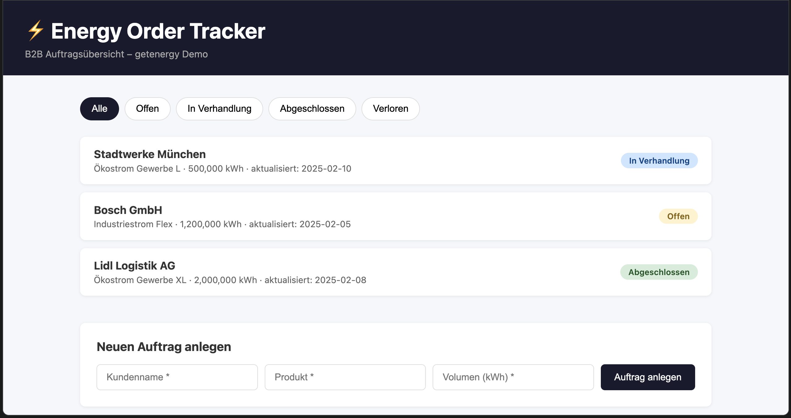

# Energy Order Tracker

## Vision

Transparente, digitale Auftragsverarbeitung für Energiedienstleister –
von Kundenanfrage bis Vertragsabschluss, ohne Medienbrüche.

## Problem Statement

Vertriebsteams arbeiten heute mit E-Mail + Excel:

- Kein zentraler Auftragsstatus
- Manuelle Datenübertragung zwischen Systemen
- Fehlende Nachvollziehbarkeit im Prozess

## Lösung

Leichtgewichtiges Dashboard für B2B-Energieaufträge mit:

- Statusverfolgung von Anfrage bis Vertragsabschluss
- Klarer Prozessstruktur (Anfrage → Angebot → Verhandlung → Abschluss)
- Grundlage für ERP-Integration

## Tech Stack

- Frontend: React + Vanilla CSS
- Backend: Node.js / Express
- Datenhaltung: JSON (Prototyp)

## PO Artefakte

- [User Stories](docs/user-stories.md)
- [Prozessflow](docs/process-flow.md)
- [Issue Templates](.github/ISSUE_TEMPLATE/)

## Status

🚧 In Entwicklung – Portfolio-Projekt zur Demonstration von PO-Methodik
und technischem Verständnis im Energiesektor.

## Preview

