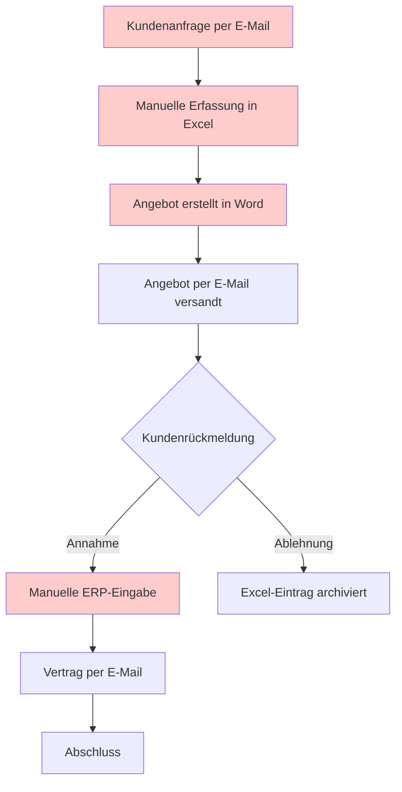
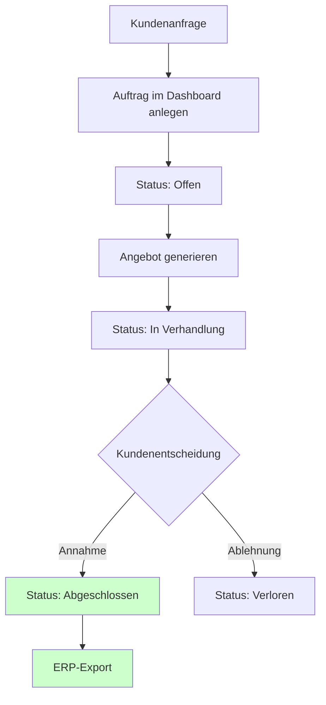

# Prozessflow: B2B Energieauftrag

## IST-Prozess (vor Digitalisierung)

**Pain Points:**

- Medienbrüche: E-Mail → Excel → Word → ERP
- Kein zentraler Status sichtbar
- Fehleranfällig bei manueller Übertragung

---

## SOLL-Prozess (mit Energy Order Tracker)

**Verbesserungen:**

- Ein zentrales System statt vier Tools
- Status jederzeit transparent
- Basis für ERP-Integration geschaffen
